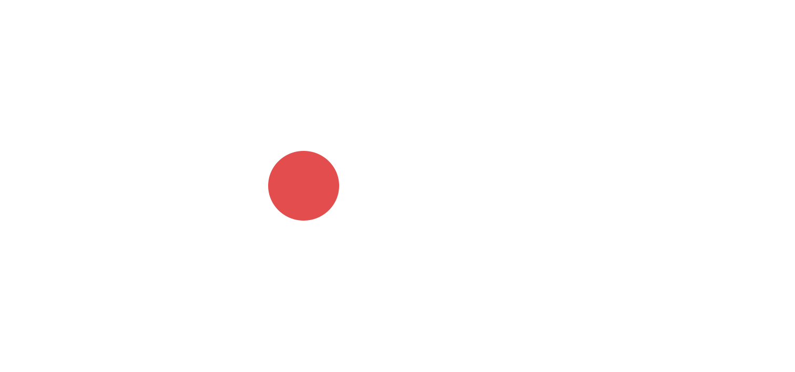
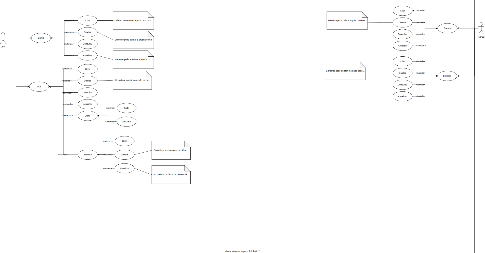
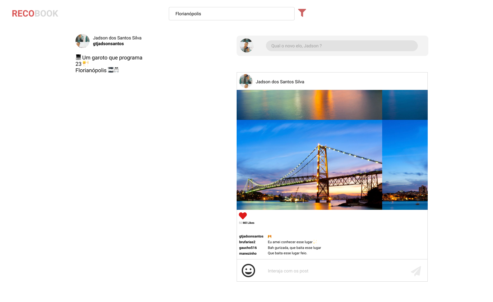

Sistema universal de recomendação de Locais 

Um website gratuito para os usuários compartilharem a sua experiência com determinado local do mundo, de forma que outras pessoas consigam saber que você viveu essa experência e quer que outras pessoas tenha essa mesma sensação em suas vidas 🥰. O nosso objetivo é simples, em defender que bons momentos devem ser compartilhados de uma forma simples.

[acesse aqui](https://recobook.com.br)

## Problema 🤦

As informações sobre os locais pelo mundo, estão descentralizadas, tornando demorado e ofuscado o processo que as pessoas tem de encontrar o local desejado para conhecer ou viajar para aquele local. Há uma grande perda tempo nesse processo 🐌.

## Solução 💡

O motivo do desenvolvimento dessa solução vem da necessidade das pessoas terem a facilidade em encontrar mais informações sobres os locais que querem conhecer, de uma forma centralizada, tornando ágil esse processo, e não apenas conhecer, mas aproveitar de uma rede de compartilhamento entre as pessoas. Para alcançar esse objetivo inicial, o sistema iniciará na web por conta da flexibilidade em alcançar  muitos públicos, pois a maioria dos sistemas operacionais linux, mac, windows, android e ios  dispõem de navegadores para acesso à plataforma recobook. 

## Público alvo 🎯

Pessoas que estão querendo conhecer novos locais. 

## Contextualização 🗣

Um `elo` nada mais que a experiência vivida por alguem em algum lugar do mundo.

Os `usuários` serão as fontes responsáveis por popular a aplicação com os elos.

## Requisitos 📜

A seguir iremos documentar alguns requisitos importantes para a plataforma de forma que fique fácil entender 

Considerando esta demanda específica universal de centralizar as experiências vividas, relaciona-se abaixo os requisitos essenciais para que seja desenvolvido um sistema para compartilhamentos de elos. Considera-se na lista de requisitos funcionais, que para toda a indicação de manter tal funcionalidade", o sistema estará apto a realizar as operações de Create, Read, Update e Delete, representados pela sigla CRUD, que significam em português as operações básicas de criação, consulta, atualização e exclusão de dados nas respectivas tabelas de armazenamento destes dados.

### Funcionais ⚙️

- `RF-1:` Manter elos - CRUD
- `RF-2:` Manter usuarios - CRUD
- `RF-3:` Manter paises - CRUD
- `RF-4:` Manter estados - CRUD
- `RF-5:` Manter comentários - CRUD
- `RF-6:` Interface de compartilhamentos
### Não funcionais ♻️

- `RNF-1`: O sistema deve ter uma versão para uso em navegador / web browser
- `RNF-2`: O sistema deve ter seu backend construído em java
- `RNF-3`: O sistema deve ter seu frontend construído em nextjs
- `RNF-3`: O sistema deve ser construido para rodar em docker

### Regras de negócio ❗️

- `RN-1`: Uma vez que o elo for curtido ou comentado, não poderá ser excluído pelo criador

### Caso de Uso 🤸

### Wireframes 🖼

[Vá para o figma :)](https://www.figma.com/file/I9X2Xs0EJeO7Zp2ejWcGFr/Untitled?node-id=15%3A32)

## Road Map 🤑

- Divulgação de anuncios dos parceiros da plataforma.

## Autor

||
|:-:|
|@jadson179|